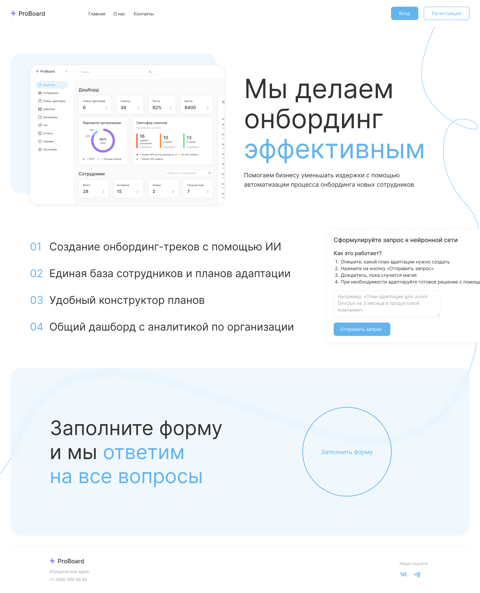

<a href="https://collabse.michkoff.com/" target="_blank" rel="noopener" align="center">
  <h1>ProBoard | Collabse</h1>
</a>
<div align="center">
  <h3>Мы делаем онбординг эффективным</h3>
  <a href="https://github.com/ParzivalEugene/Collabse-LCT-Krasnodar/blob/main/LICENSE">
    
  </a>
  <a href="https://collabse.michkoff.com/">
    
  </a>
</div>
<div align="center">
  <br />
  
  <br />
  <br />
</div>



## Stack

| Scope    | Technology                                |
| -------- | ----------------------------------------- |
| Frontend | [Next.js](https://nextjs.org/)            |
| Backend  | [FastAPI](https://fastapi.tiangolo.com/)  |
| Database | [PostgreSQL](https://www.postgresql.org/) |
| Hosting  | [Netlify](https://www.netlify.com/)       |

## Подробнее о фронтенде

Оптимизация времени ревалидации запросов за счет использования улучшенного redux менеджера состояний (redux-toolkit и rtk-query)

Использование фреймворка Next.JS, который оптимизирует время отклика пользователя за счет серверного рендеринга компонентов.

Значительное улучшение опыта создания плана адаптации в формате markdown, реализован механизм создания шаблонов для пользователей любого уровня владения технологиями

Решение уже сейчас отвечает большинству стандартов индустрии и уже готово к внедрению

## Установка и запуск

### Установка зависимостей

```bash
pnpm install
```

### Запуск

```bash
pnpm run dev
```

## Базовое тестирование

В базе данных доступны пользователи для показа

| Логин          | Пароль |
| -------------- | ------ |
| hr_example     | 1234   |
| worker_example | 1234   |
